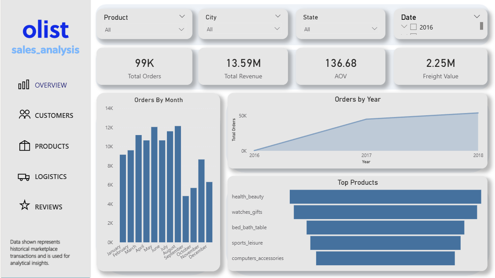
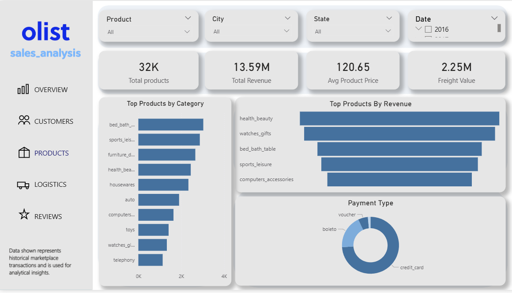
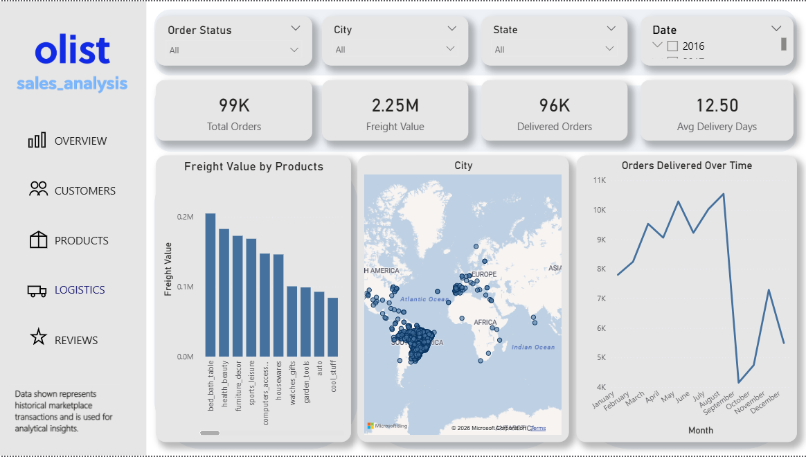

# E-Commerce Sales Analysis

## Project Overview
The Olist marketplace dataset provides detailed information about e-commerce transactions including customers, orders, sellers, products, payments, and reviews.  
This project analyzes marketplace performance to understand sales trends, customer behavior, logistics efficiency, and product performance.

The analysis combines **Python for exploratory data analysis, SQL for structured queries, and Power BI for interactive dashboard visualization** to generate meaningful business insights.

---

## Tools & Technologies
- Python
- Pandas
- NumPy
- SQL
- Power BI
- Jupyter Notebook

---

## Dataset
The dataset contains multiple related tables representing marketplace operations.

Key tables include:

- Customers  
- Orders  
- Order Items  
- Products  
- Sellers  
- Payments  
- Reviews  
- Geolocation  

Key features include:

- Order ID  
- Customer Location  
- Product Category  
- Product Price  
- Freight Value  
- Seller Information  
- Review Score  
- Order Purchase Timestamp  
- Delivery Dates  

---

## Project Workflow
1. Data Cleaning and Preprocessing using Python  
2. Merging multiple dataset tables to create a unified dataset  
3. Exploratory Data Analysis (EDA) to understand sales and customer behavior  
4. SQL queries to analyze sales, orders, and product performance  
5. Development of an interactive Power BI dashboard for business insights  

---

## Key Insights
- The marketplace processed **~99K orders generating ~13.5M in revenue**.
- **Health & Beauty and Watches & Gifts** are among the top selling product categories.
- Customers are concentrated in major regions such as **São Paulo**.
- **Freight cost increases with product weight**, impacting logistics expenses.
- **Delivery delays negatively impact customer review scores**.
- Overall customer satisfaction remains high with an **average rating around 4 stars**.

---

## Dashboard Preview






---

## Business Recommendations
- Improve delivery efficiency to reduce delays and improve customer satisfaction.
- Focus marketing strategies on top performing product categories.
- Optimize freight and logistics costs for heavy products.
- Encourage repeat purchases through loyalty programs.
- Monitor product quality and seller performance using customer reviews.

## Repository Structure
```
ecommerce-sales-analysis

│
├── data
├── sql
│
├── notebook
│ └── sales_analysis.ipynb
│
├── dashboard
├── Report.docx
│ 
├── dashboard_preview.png
├── dashboard_preview_1.png
├── dashboard_preview_2.png
│
└── README.md
```
---
## Conclusion
This project demonstrates a complete **end-to-end data analysis workflow**:

Data preprocessing → Exploratory data analysis → SQL analysis → Dashboard visualization.

The insights derived from this analysis help understand **e-commerce sales trends, customer behavior, logistics efficiency, and product performance**, enabling businesses to make **data-driven decisions for growth and operational optimization**.
